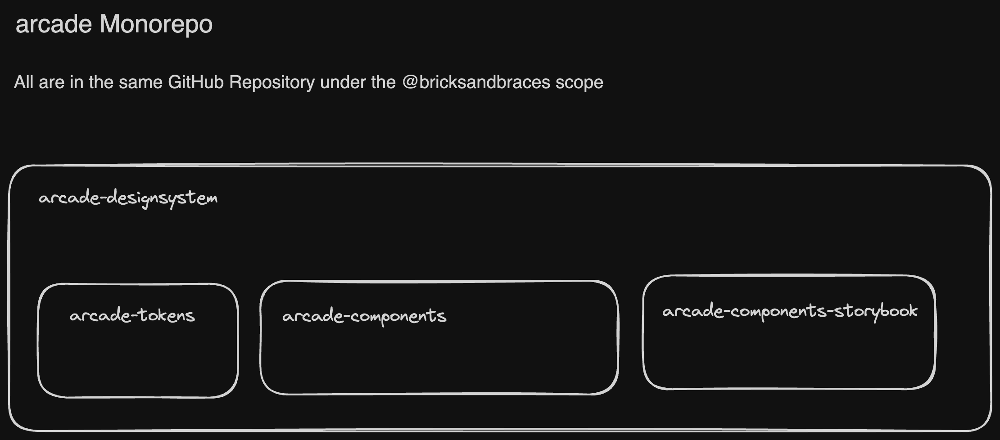

# Monorepo

A monorepo is a code management and architectural concept where you keep all your code in a single repository. This is in contrast to the more traditional approach where you have many repositories, each for a single project or module.

We use one monorepo for the arcade-designsystem which is a frontend project.



We leverage `lerna` and yarn workspaces to manage the monorepo. Lerna is a tool that optimizes the workflow around managing multi-package repositories with git and npm.

## Usage

You mostly interact with the monorepo through the `lerna` CLI while you are at the root of the monorepo.

Installing Dependencies:

```bash
yarn install
```

Running a command in **all** packages:

```bash
yarn lerna run <command>
```

Running a command in a specific package:

```bash
yarn lerna run <package-prefix>:<command>
```

> Note: The command above will only run if the package contains an according script.

alternatively:

```bash
yarn lerna run <command> --scope=<package-name>
```

## Link within the Monorepo

lerna will automatically link packages within the monorepo. This means that if you have a package that depends on another package in the monorepo, you can simply import it as if it were a node module.

Requirement for this is that the package is listed in the `dependencies` of the `package.json` of the package that depends on it.
While in development phase we use the `workspace:*` versioning to automatically always use the local version of the package.

## Adding a new package

To add a new package to the monorepo, you can use the following command:

```bash
yarn lerna create <package-name>
```

## Publishing a package to the GH Package Registry

To publish and interact with the GitHub Package Registry see [GH-Packages Documentation](../GH-Packages/GH-Packages.md).
