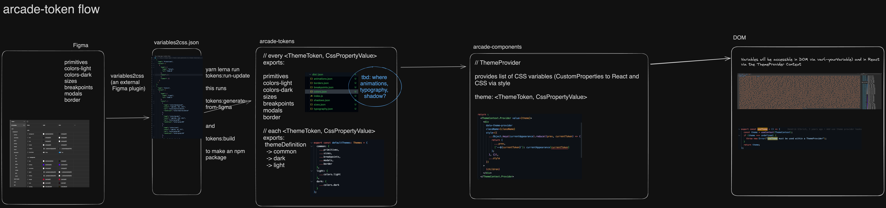

# TokenFlow

See the diagram [TokenFlow.excalidraw](./TokenFlow.excalidraw) for a visual representation of the TokenFlow.

## 1) Figma Tokens

The Figma Designs contains several collections of Tokens. These Tokens are used to define the design system of the application. The Tokens are stored in the Figma file and are used to generate the design tokens.

## 2) Figma Plugin: variables2css

The Figma Plugin `variables2css` is used to generate the design tokens from the Figma Tokens. The Plugin reads the Tokens from the Figma file and generates the design tokens in the form of CSS variables.

The file is then manually pasted into `packages/arcade-tokens/variables2css.json`.

From there it is possible to run two tasks:

1. `tokens:generate-from-figma` which will generate files under `src/generated` with the tokens in it. Note: they should never be manually edited. All changes should be done in the Figma file and then re-generated.
2. `tokens:build` which will take all source files from `src` and generate the final package export under `dist`.

The command `tokens:run-update` will execute both commands in sequence.

## 3) arcade-tokens

The `arcade-tokens` package contains is build as described before. It also contains some management and utility functions to gather all the tokens in a type-safe way and export them. It should be published to the BB registry on GH pages. [See the Documentation](../GH-Packages/README.md).

## 4) arcade-components

The `arcade-components` package contains the components that use the tokens. It imports the tokens from the `arcade-tokens` package and uses them to style the components. It should also be published to the BB registry on GH pages. [See the Documentation](../GH-Packages/README.md).

The `arcade-components` package provides the tokens to the UI components in two ways.

## 5) Usage of tokens in field

The tokens are used in the components to style the components. The tokens are used in the components in two ways:

1. **CSS Custom Properties** - The tokens are used via `var(--token-name)` in the CSS of the components.
2. **ReactJS** - The tokens are used via the `useTheme()` hook. The `useTheme()` hook is used to get the tokens from the theme and use them in the components.
